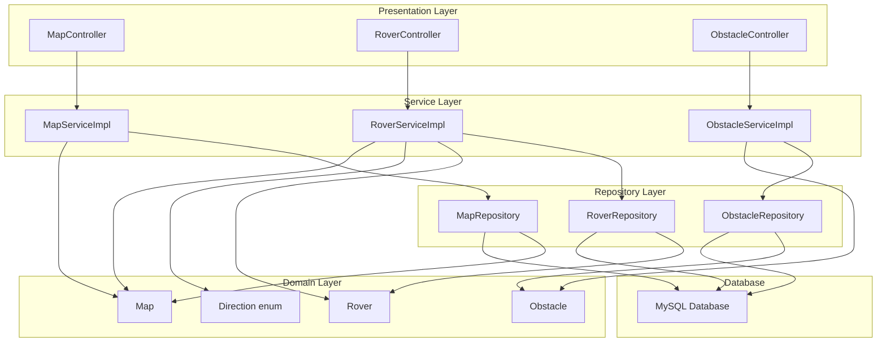
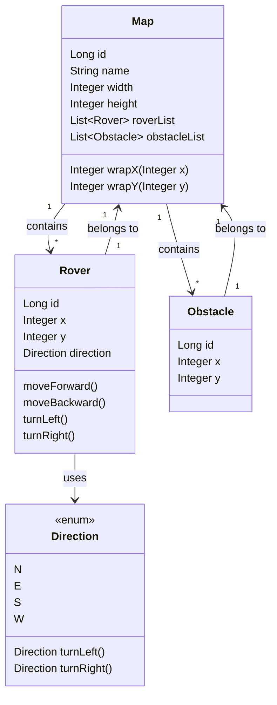
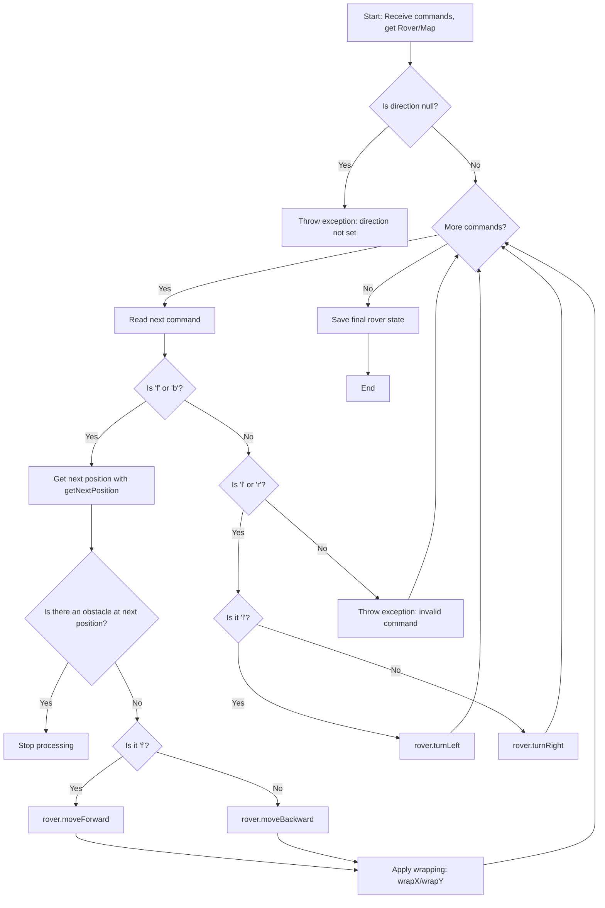

# 🚀 Mars Rover - Technical Challenge

Del Sol Mars Rover is a REST API built with Java and Spring Boot that lets you manage a simulated Mars environment. You can create maps, obstacles, and rovers, and send commands to control their movement.

---

## 📚 Description

This API allows you to:

- Create and delete **maps**, **obstacles**, and **rovers**
- View all maps, obstacles, and rovers, or search by ID
- Control a rover's movement on a map (including obstacle detection and edge wrapping)

---
## 🛠 Technologies Used

- **Java 17**
- **Spring Boot**
- **Spring Web**
- **Spring Data JPA**
- **MySQL** (relational database)
- **JUnit 5** and **Mockito** (for testing)
- **Lombok**
- **Maven**

---
## 📦 Installation

### 1. Prerequisites

Make sure you have installed:

- Java 17 or higher
- Maven
- MySQL
- An IDE like IntelliJ IDEA (recommended)

---
### 2. Clone the Repository

```bash
git clone https://github.com/E-delSol/mars_rover.git
cd del-sol-mars-rover
```

### 3. Configure the Database

#### Step 1: Create the MySQL Database

Connect to your MySQL server and run this command:

```sql
CREATE DATABASE mars_rover_db;
```

#### Step 2: Set Database Credentials

Open the file `src/main/resources/application.properties` and update:

```properties
spring.datasource.url=jdbc:mysql://localhost:3306/mars_rover_db
spring.datasource.username=your_user // default "root"
spring.datasource.password=your_password // default ""
```

Replace `your_user` and `your_password` with your real MySQL credentials.

#### Step 3: Check Connection

Run the app. If the configuration is correct, Spring Boot will connect to the database and create all tables.

If there's an error, check:

- MySQL is running
- Credentials are correct
- Port 3306 is open

---

### 4. Build the Project

```bash
mvn clean install
```

---

### 5. Run the App

```bash
mvn spring-boot:run
```

The API will be available at:  
📍 `http://localhost:8080`

---

## ✅ Tests

To run the tests and check coverage:

```bash
mvn test
```

This project includes 68 tests that cover:

- Valid and invalid service cases
- Business logic (movement, direction, obstacles)
- REST controllers

---

## 🧭 API Endpoints

### 🗺️ Maps

|Method|Endpoint|Description|
|---|---|---|
|GET|`/maps`|Get all maps|
|GET|`/maps/{id}`|Get map by ID|
|POST|`/maps`|Create a map|
|DELETE|`/maps/{id}`|Delete a map|

## 🤖 Rovers

|Method|Endpoint|Description|
|---|---|---|
|GET|`/rovers`|Get all rovers|
|GET|`/rovers/{id}`|Get a rover by ID|
|POST|`/rovers`|Create a new rover|
|DELETE|`/rovers/{id}`|Delete a rover|
|POST|`/rovers/{id}/commands`|Send commands to a rover|

## 🚧 Obstacles

|Method|Endpoint|Description|
|---|---|---|
|GET|`/obstacles/{mapId}`|Get obstacle by mapId|
|POST|`/obstacles`|Create a new obstacle|
|DELETE|`/obstacles/{id}`|Delete an obstacle|

---

## 🗺️ Rover Movement & Commands

Available commands for a rover:

- `f`: move forward
- `b`: move backward
- `l`: turn left
- `r`: turn right

The rover moves using cardinal directions (`N`, `E`, `S`, `W`).  
Map edges are wrapping (like a torus).

---

## 🧱 Project Structure

```bash
src ├── main
│   ├── java
│   │   └── com.pecado.del_sol_mars_rover
│   │       ├── controller
│   │       ├── service
│   │       ├── model
│   │       ├── dto
│   │       └── repository
│   └── resources
│       └── application.properties
└── test
	└── java
		 └── com.pecado.del_sol_mars_rover
			  └── (unit tests)
```

## 🧱 Architecture Diagram



---

### 🗺️ Class Diagram



### 🚦 Rover Command Flow



---

## 📘 API Documentation - Swagger UI

The application includes interactive API documentation generated with **Swagger** using `springdoc-openapi`.

### ▶️ View Swagger Documentation

When the application is running, you can open the Swagger UI at:

```bash
http://localhost:8080/swagger-ui.html
```

Or alternatively:

```bash
http://localhost:8080/swagger-ui/index.html
```

This will open an interactive interface where you can test all endpoints (GET, POST, DELETE, etc.), see their descriptions, parameters, and expected responses.

---

## ✍️ Author

Created by **Enrique del Sol** as part of a technical challenge.

---

## 📄 License

This project is under the MIT License.